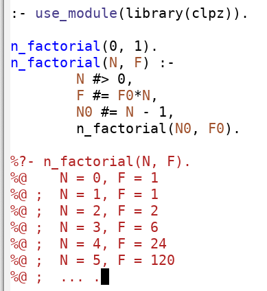

# Introduction

*ediprolog* lets you interact with Prolog in all Emacs buffers.
You can consult Prolog programs and evaluate embedded queries.

**Project page**:

[**https://www.metalevel.at/ediprolog/**](https://www.metalevel.at/ediprolog/)

**Video**:

[https://www.metalevel.at/prolog/videos/ediprolog](https://www.metalevel.at/prolog/videos/ediprolog)

See also [PceProlog](https://www.metalevel.at/pceprolog/).

# Installation

With Emacs≥24.1, the simplest way to install ediprolog is to use
Emacs's built-in *package manager* via the key sequence:

    M-x package-install RET ediprolog RET

Alternatively, copy [ediprolog.el](ediprolog.el) to your `load-path`
and add the following form to your `.emacs`, then evaluate the form or
restart Emacs:

    (require 'ediprolog)

After you have installed ediprolog, you can customize it with:

    M-x customize-group RET ediprolog RET

The two most important configuration options are:

   - `ediprolog-system`, either `scryer` (default) or `swi`
   - `ediprolog-program`, the path of the Prolog executable.

# Usage

The central function is `ediprolog-dwim` (Do What I Mean). I recommend
to bind it to the function key F10 by adding the following
form to your `.emacs` and evaluating it:

    (global-set-key [f10] 'ediprolog-dwim)

In the following, I assume that you have also done this.

Depending on the content at point, `ediprolog-dwim` does the
"appropriate" thing: If point is on a *query*, it sends the query to a
Prolog process, and you interact with the process in the current
buffer as on a terminal. Queries start with "?-" or ":-", possibly
preceded by "%" and whitespace. An example of a query is:

    %?- member(X, "abc").

If you press F10 when point is on that query, you get:

    %?- member(X, "abc").
    %@    X = a
    %@ ;  X = b
    %@ ;  X = c
    %@ ;  false.

When waiting for output of the Prolog process, you can press C-g to
unblock Emacs and continue with other work. To resume interaction
with the Prolog process, use **M-x ediprolog-toplevel RET**.

If you press F10 when point is *not* on a query, the buffer content is
consulted in the Prolog process, and point is moved to the first error
(if any). You do *not* need to *save* the file beforehand, since
the *buffer content* (not the file) is consulted.

For convenience, the most recent interactions with the Prolog
process are logged in the buffer `*ediprolog-history*`.

Use **M-x ediprolog-localize RET** to make any Prolog process started
in the current buffer buffer-local. This way, you can run distinct
processes simultaneously. Revert with
**M-x ediprolog-unlocalize RET**.

`ediprolog-dwim` with prefix arguments has special meanings:

| Key Sequence |   Meaning                                                |
|--------------|----------------------------------------------------------|
|  C-0 F10     |   kill Prolog process                                    |
|  C-1 F10     |   always consult buffer (even when point is on a query)  |
|  C-2 F10     |   always consult buffer, using a new process             |
|  C-7 F10     |   equivalent to `ediprolog-toplevel'                     |
|  C-u F10     |   first consult buffer, then evaluate query (if any)     |
|  C-u C-u F10 |   like C-u F10, with a new process                       |

Tested with Scryer Prolog 0.8.119 and SWI-Prolog 8.1.24, using Emacs
versions 26.1 and 27.0.50.

# Screenshot

Here is a sample interaction, using
[CLP(ℤ) constraints](https://www.metalevel.at/prolog/clpz) to
relate a number to its factorial:

